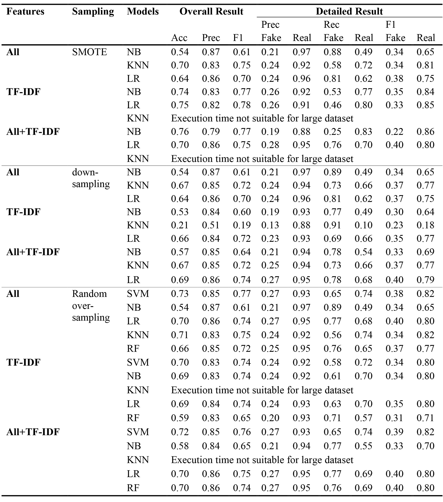
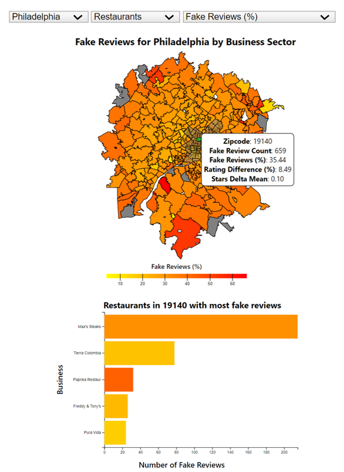

# Detection and Visualization of Fradulent Reviews on Yelp

Table of Contents:
1. Introduction
2. Quick-start Instructions
3. Visualization Description
4. End-to-end Instructions
5. Data Sources

-------------------------------------------------------------------------------------------------------------

## 1. Introduction

  This repo is for code and documentation around the Yelp fake review project in GTech's CSE6242 class. For this project we trained 5 classifiers on the YelpZip dataset, a binary classification problem that determined whether a review was real or fake. We compared the results between Support Vector Machine (SVM), Naive Bayes (NB), K-Nearest Neighbor (KNN), Logistic Regression (LR) and Random Forest (RF). 
  
  We found RF with TF-IDF and SMOTE oversampling to be our best performing model, with an F1-score of 0.8. We then ran our model to generate labels for the Kaggle V4 Yelp dataset and developed an interactive visualization application with D3.js as an analytical tool. The full report [Detection and Visualization of Fraudlent Reviews on Yelp](https://github.com/csaw51/yelp-fake-review-project/blob/main/Detection_and_Visualization_of_Fraudulent_Reviews_on_Yelp.pdf) is published to the root of the repository.
  
The raw dataset was pre-processed and engineered using:
  - Synthetic minority over-sampling (SMOTE) for balancing the dataset
  - TF-IDF for sentiment analysis
  - Feature selection to remove highly correlated behavior and textual features

*System design for model development*

We compared the results of all combination of features, resampling techniques, and supervised learning algorithms. Final results are shown in the table below. The main evaluation used to quantify the performance of classification models were accuracy, precision, recall, and F1-score. From our data, it was evident that RF outperformed SVM, NB, KNN and LR using the combination of all features after removing multicollinearities with TF-IDF and using SMOTE as a resampling technique. It showed an overall accuracy of 77\%, 63\% recall for the minority class, and 79\% recall for the majority class in fake review detection. 

Behavioral features outperformed textual features where the accuracy had increased by 18.87\%. The addition of the TF-IDF features to the textual features improved accuracy from 53\% to 70\% using linear SVM and SMOTE, and the inclusion of behavioral features improved recall for the minority class from 45\% to 64\% in our baseline SVM model.


*Results of experiments using different models and over/down-sampling techniques*

To prepare the data for the visualization, we performed exploratory data analysis (EDA) using pandas, matplotlib, and an in-memory SAS visualization tool. This informed our pre-visualization manipulation strategy and revealed several data cleanup and transformation tasks, such as misaligned zip codes and spelling errors in address fields. 

An example visualization is shown below. The application can be tested locally by downloading the repository and following the quick-start instructions in section 2. An in-depth description of the visualization features are included in section 3 and are further described in the report.


*Example from visualization application written in D3.js showing percentage of fake reviews by zipcode for restaurants in Philadelphia.*

-------------------------------------------------------------------------------------------------------------

## 2. Quick-start Instructions

  - Download and unzip the repository.
  - Download zip code [geojson files](https://github.com/OpenDataDE/State-zip-code-GeoJSON) to the root of the data/json folder.
  - Unzip data/data_merged.zip to the root of the data folder.
  - Run python/DataProcessing.py to convert the model output into the visualization input. Start up a localhost server and navigate to the root folder. Open 'main.html'.
  - Start up a localhost server and navigate to the root folder. Open 'main.html'.
  
-------------------------------------------------------------------------------------------------------------

## 3. Visualization Description
 The visualization includes a chloropleth map, bar chart, and three dropdowns for altering the the map and barchart.
 The first dropdown changes the city, the second changes the business sector, and the third changes the metric for coloring the
 chloropleth map and bar chart. The metrics include:
 - Fake Reviews (%): Percentage of fake reviews out of the total number of reviews.
 - Stars Absolute Difference (%): Absolute relative percent difference of star rating with fake reviews and without fake reviews.
 - Stars Change with Fake Reviews: Change in star rating calculated as the rating excluding fake reviews subtracted from the rating including all reviews.

 The chloropleth map is filtered by the city and business sector specified in the dropdowns.  The light grey overlay in the middle of the map shows the boundaries for the chosen city. 
 The map is divided by zipcode and colored by the metric chosen in the dropdown. Hover over the map to show a:
 - Tooltip including the hovered zipcode, number of fake reviews and all three metrics for the hovered zipcode.
 - Bar chart shows the top five businesses with the largest number of fake reviews for the hovered zipcode. Bars are colored by the chosen metric for each business.
 Clicking anywhere on the map locks the bar chart in place and colors the clicked zip code green. Clicking anywhere else on the page afterwards unlocks the chart.

-------------------------------------------------------------------------------------------------------------

## 4. End-to-end Instructions

  1. All required python packages can be installed using the included requirements.txt:
    ```
    python -m pip install -r requirements.txt
    ```

  3. Pre-processing the YelpZip training data:
     - Download the YelpZip dataset (https://drive.google.com/drive/folders/16A3lqy53BdCr-K70NnOgb205SruxIcub) reviewContent and metadata files to the data directory.
     - Run the script python/join_yelp_zip_data.py to create an inner join between the individual yelpzip files.
       Usage: `python join_yelp_zip_data.py`
       There are optional command line parameters that can be utilized as needed if any of the default file paths are modified after download:
         - metadata_path={metadata filepath}: YelpZip metadata containing user data, rating, date, and label
         - review_content_path={reviewContent filepath}: YelpZip review data
         - output_filepath={output tsv filepath}: Output filepath. Default: 'data/yelpzip_joined.tsv'. **The output path MUST end in .tsv in order for the next script to run**

  4. Feature engineering on preprocessed data:
     - Download [Yelp Academic Dataset V4](https://www.kaggle.com/datasets/yelp-dataset/yelp-dataset), files yelp_academic_dataset_business.json and yelp_academic_dataset_review.json to the data directory.
     -  Once pre-processing is finished, we can run the full feature engineering to add textual, behavioral, and TF-IDF features with python/preprocessing_pipeline.py
     - By default, this script is intended to run on the academic yelp dataset, and as such you will have to use the --input_path parameter to point it to the correct file, which is the output of the join_yelp_zip_data.py file from above.
       Usage: `python preprocessing_pipeline.py --input_path='../data/yelpzip_joined.tsv'`
       There are optional command line parameters that can be utilized as needed:
       - input_path={input path}: File path for input dataset
       - output_path={output tsv filepath}: File path for output dataset. Default: 'data/yelp_academic_dataset_preprocessed.tsv'.
       - positive_word_path={positive-words path}: Point to the positive opinion lexicon file postitive-words.txt
       - negative_word_path={negative-words path}: Point to the negative optinion lexicon file negative-words.txt
       - n_process={number of cpus}: The number of processes that the script will use while parallelizing the workload **For the YelpZip training data, the default of 4 should be fine, or use 1 if you are worried about CPU usage and the parallelism will be disabled**
     **WARNING**: This is a very large dataset and this script will take a very long time to complete. You should NOT attempt to run this script unless you have atleast 32GB of memory and over 8 hours of time. This preprocessing was done on a Windows 10 computer with 32GBs of memory and an 8-core processor, with total runtime of around 9 hours.

5. Generating Model Predictions

   The trained model can be downloaded from my personal [google drive](https://drive.google.com/drive/folders/1dtbj9AsoQ1mubjxAIrev9Q2kP62EBdGh?usp=sharing). This *must* be downloaded to python directory as it must be located in the same directory as the generate_model_inferences.py script. Once the script is finished running, it will produce a two-column CSV containing the review_id and the predicted review_label to the output file path.

   Once the pickled model is imported, run the script in order to generate a file of inferences:
        `python generate_model_inferences.py`
        There are optional command line parameters that can be utilized as needed:
        - input_path={input path}: Path to the preprocessed feature data from step 3.
        - output_path={output csv filepath}: File path for output dataset. Default: 'data/reviews_with_predicted_label_final_rf.csv'.
        - model_path={model filepath}: Model file path. Must be downloaded from google drive as mentioned above, or can be generated using the [final results notebook](https://github.com/csaw51/yelp-fake-review-project/blob/main/python/notebooks/final_model_results.ipynb).
    **Note**: This script is intended to be run on the preprocessed Yelp Academic dataset, however it will successfully run on the preprocessed YelpZip dataset as well, with a key difference being that the YelpZip output will contain the index column instead of review_id (as the YelpZip data does not contain a review_id). The YelpZip inferences WILL NOT work with the visualization, ONLY the Yelp Academic inferences will run with the visualization.

6. Run the Visualization
   - Download zip code [geojson files](https://github.com/OpenDataDE/State-zip-code-GeoJSON) to the root of the data/json folder.
   - Run python/DataProcessing.py to convert the model output into the visualization input 'data_merged.csv'.
   - Start up a localhost server and navigate to the root folder. Open 'main.html'. Refer to section 3, visualization description, for usage.

 -------------------------------------------------------------------------------------------------------------

## 5. Data Sources
 - Yelp Academic Dataset V4 (https://www.kaggle.com/datasets/yelp-dataset/yelp-dataset): files yelp_academic_dataset_business.json and yelp_academic_dataset_review.json
 - YelpZip (https://drive.google.com/drive/folders/16A3lqy53BdCr-K70NnOgb205SruxIcub): file ReviewContent
 - Zipcode GeoJson files (https://github.com/OpenDataDE/State-zip-code-GeoJSON)
 - Metro Outline GeoJson files generated with Polygon Creation Application (http://polygons.openstreetmap.fr/index.py)
- Opinion lexicon (positive and negative word lists) (https://gist.github.com/mkulakowski2/4289437 and https://gist.github.com/mkulakowski2/4289441)
